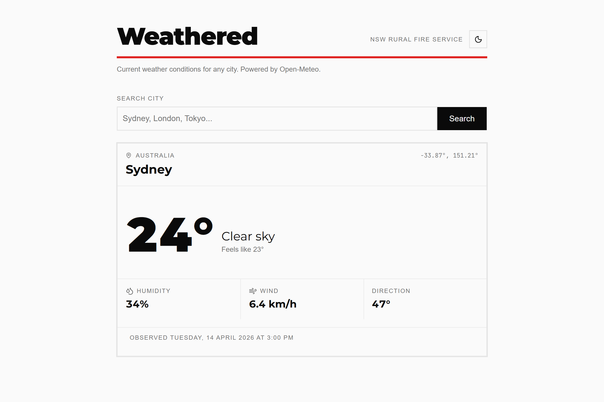
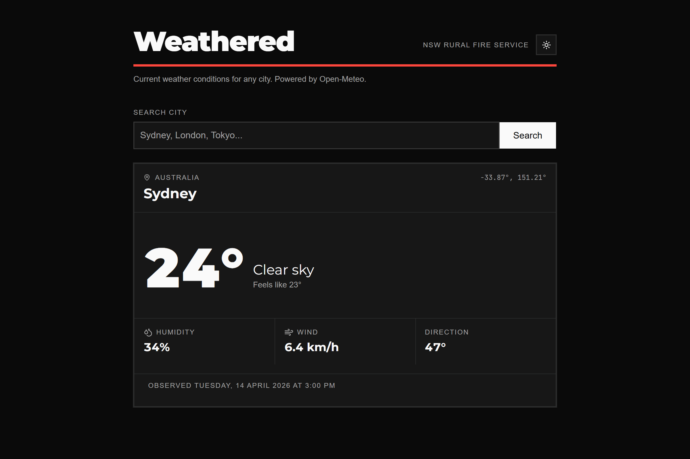

# Weathered

[](https://github.com/ToanThanhTu/weathered/actions/workflows/ci.yml)

Full-stack weather app consuming the public [Open-Meteo](https://open-meteo.com/) API. Built for the NSW Rural Fire Service Junior Full Stack Developer technical assignment.

Search for a city, see current conditions. Handles empty searches, unknown cities, upstream failures, and rate limits with typed error states end-to-end.





## Overview

Weathered is a React + Express + TypeScript monorepo.

A React 19 single-page app takes a city name, calls a Node backend that orchestrates two Open-Meteo requests (geocode then current forecast), normalizes the result, and renders it with discriminated `idle | loading | error | success` states. The backend proxy layer adds input validation, structured logging, LRU caching with single-flight deduplication, per-IP rate limiting, and a uniform error envelope.

Goals:

- Strict TypeScript, zero `any`, end-to-end type safety via shared Zod schemas
- Production-ready middleware: security headers, CORS allowlist, request IDs, graceful shutdown
- One meaningful integration test per critical path, not exhaustive coverage
- Single-command local runs via `pnpm dev` or `docker compose up`

## Architecture

```
┌──────────────┐    /api/*     ┌────────────────┐    HTTPS    ┌──────────────┐
│   Browser    │ ------------> │   Express 5    │ ----------> │  Open-Meteo  │
│  (React 19)  │ <------------ │   (Node 24)    │ <---------- │  (no key)    │
└──────────────┘               └────────────────┘             └──────────────┘
   Vite 8                        Zod env + query validation
   Tailwind v4                   pino structured logging
   shadcn/ui                     request-ID propagation
   TanStack Query                LRU cache + single-flight
   React Compiler                express-rate-limit (path-scoped)
```

Request lifecycle (happy path):

1. `SearchBar` validates `city` via `WeatherQuerySchema` (shared Zod) before submit.
2. `useWeather(city)` (TanStack Query) fires `GET /api/weather?city=...`.
3. Backend re-validates the query, checks the LRU cache, then calls Open-Meteo's geocoder and forecast endpoints.
4. Response is normalized into a shared `WeatherResponse` DTO and cached for 5 minutes.
5. `WeatherPanel` branches on the query state and renders the matching component.

Failure modes: validation errors, city-not-found, upstream 4xx/5xx/timeout, schema drift, and rate-limit hits all funnel through typed `AppError` subclasses into a central error handler that emits a uniform `ErrorResponse` envelope. Stack traces and internal paths never reach clients.

## Tech stack

| Layer         | Choice                                             | Rationale                                                                                          |
| ------------- | -------------------------------------------------- | -------------------------------------------------------------------------------------------------- |
| Runtime       | **Node.js 24 LTS**                                 | Native `--env-file`, native `fetch`, top-level `await`. No `dotenv` needed.                        |
| Language      | **TypeScript 6** (strict)                          | `noUncheckedIndexedAccess`, no `any` anywhere (grep yields zero).                                  |
| Monorepo      | **pnpm 10 workspaces**                             | Strict dependency isolation, first-class workspace protocol, no extra orchestrator.                |
| Shared types  | **`@weathered/shared`** (Zod 4)                    | Single source of truth for request/response shapes. Types derived via `z.infer`, never hand-written. |
| Backend       | **Express 5**                                      | Stable, async error propagation, universally readable. Zero cognitive tax on the reviewer.         |
| Validation    | **Zod 4**                                          | Env vars at startup (fail-fast), query params, upstream responses.                                 |
| Logging       | **pino** + **pino-http**                           | Structured JSON, request-ID propagation via `x-request-id`, pretty transport in dev only.          |
| Security      | **helmet** + explicit **CORS allowlist**           | Free defense-in-depth, never `*`.                                                                  |
| Rate limiting | **express-rate-limit** (draft-8 headers)           | Path-scoped to `/api/weather`. `/api/health` stays unlimited for infra probes.                     |
| Caching       | **lru-cache** wrapped in a generic HOF             | Bounded memory via LRU, 5-min TTL, **single-flight** (concurrent callers share one upstream promise). |
| Weather API   | **Open-Meteo**                                     | Free, no key, geocoding + forecast in the same API family.                                         |
| Frontend      | **React 19** + **Vite 8** + **React Compiler**     | Form actions, auto-memoization (no manual `useMemo`/`useCallback`), Rolldown build.                |
| UI            | **Tailwind v4** + **shadcn/ui**                    | CSS-first `@theme`, OKLCH colors, Radix primitives. Lyra-inspired square corners.                  |
| Data fetching | **TanStack Query v5**                              | `enabled` gating gives idle state for free. `staleTime: 5min` matches backend cache TTL.           |
| Forms         | **React 19 form actions**                          | `<form action={handler}>`, no `preventDefault` boilerplate.                                        |
| Icons         | **lucide-react**                                   | Tree-shakeable, matches shadcn aesthetic.                                                          |
| Testing       | **Vitest 4** + **Supertest** + **RTL** + **jsdom** | In-process backend tests via the `createServer()` factory. Role-based frontend queries.           |
| CI            | **GitHub Actions**                                 | `lint → typecheck → test` on push and PR, concurrency groups, frozen lockfile.                     |
| Container     | **Multi-stage Docker** + **nginx** reverse proxy   | Compose brings up the whole stack. nginx proxies `/api` to backend (same-origin).                  |

See [`docs/Weathered-plan.md`](docs/Weathered-plan.md) for the full build log and decision history.

## Prerequisites

- **Node.js 24 LTS** (see [`.nvmrc`](.nvmrc))
- **pnpm 10+**
- _(optional)_ **Docker** + **Docker Compose** for the container path

```sh
nvm use              # picks up .nvmrc
node --version       # v24.x
pnpm --version       # 10.x
```

## Getting started

### Option A: pnpm (local dev)

```sh
pnpm install
cp apps/backend/.env.example apps/backend/.env
pnpm dev
```

- Frontend: http://localhost:5173
- Backend: http://localhost:3000

The root `dev` script chains `pnpm -r build && pnpm -r --parallel dev`. `packages/shared` compiles once, then backend (`tsx watch`), frontend (`vite`), and shared (`tsc --watch`) all run concurrently with hot reload.

### Option B: Docker (production-like, one command)

```sh
docker compose up --build
```

- App: http://localhost (nginx serves the frontend and proxies `/api/*`)
- Backend (direct): http://localhost:3000

Two multi-stage builds:

- **Backend**: Node 24 alpine, `pnpm deploy --prod` produces a flattened runtime image, non-root `USER node`.
- **Frontend**: Node 24 alpine builder → `nginx:alpine` runner serving the Vite `dist/` with an SPA fallback and a `/api/` reverse proxy to the backend container.

The backend has a healthcheck and the frontend `depends_on: { backend: { condition: service_healthy } }`, so compose waits for `/api/health` before bringing up nginx. Same-origin through nginx means no CORS preflight in the production path.

> **Port conflict note:** if another service already uses host port 80, the frontend container won't be reachable. Either stop the conflict (e.g. `sudo systemctl stop apache2`) or change the published port in `docker-compose.yml` (e.g. `'8080:80'`).

## HTTP API

| Method | Path                            | Description                                                      |
| ------ | ------------------------------- | ---------------------------------------------------------------- |
| `GET`  | `/api/health`                   | Liveness probe: `{ status, uptime, timestamp }`. Unlimited.      |
| `GET`  | `/api/weather?city=<string>`    | Geocode + forecast + normalize. Cached 5 min per normalized city. |

Rate limit on `/api/weather`: **60 requests per minute per IP** with IETF draft-8 standard headers.

### Success response

```json
{
  "data": {
    "location": {
      "name": "Sydney",
      "country": "Australia",
      "latitude": -33.87,
      "longitude": 151.21
    },
    "current": {
      "temperature": 22.5,
      "apparentTemperature": 23.1,
      "humidity": 65,
      "windSpeed": 12.4,
      "windDirection": 180,
      "condition": "Mainly clear",
      "observedAt": "2026-04-14T00:00:00.000Z",
      "timezone": "Australia/Sydney"
    }
  }
}
```

`observedAt` is a real UTC ISO string. The backend converts Open-Meteo's naive local time via `utc_offset_seconds` and passes the IANA `timezone` through so the frontend can render the time in the **city's** local timezone with `Intl.DateTimeFormat({ timeZone })`.

### Error envelope

All failures (validation, not-found, upstream, rate limit, internal) return the same shape. No stack traces, no internal paths.

```json
{
  "error": {
    "code": "CITY_NOT_FOUND",
    "message": "City Xyzzy not found.",
    "details": null
  }
}
```

| HTTP | `code`             | When                                                      |
| ---- | ------------------ | --------------------------------------------------------- |
| 400  | `VALIDATION_ERROR` | Query failed `WeatherQuerySchema.safeParse`               |
| 404  | `CITY_NOT_FOUND`   | Open-Meteo geocoder returned no results                   |
| 429  | `RATE_LIMITED`     | Per-IP rate window exhausted                              |
| 502  | `UPSTREAM_ERROR`   | Non-2xx, timeout, network error, or unexpected JSON shape |
| 500  | `INTERNAL_ERROR`   | Unhandled exception (generic, no internal detail leaked)  |

## UI and design

- **Lyra-inspired visual language.** Square corners throughout (`--radius: 0`), thick borders instead of shadows, strong typographic hierarchy with one dominant element per card (the temperature at `text-8xl`).
- **RFS red as a single accent.** Used in exactly three places: the header underline bar, the search input focus ring, and the search button hover state. Everywhere else stays neutral.
- **Typography.** Headings use `'Gotham', 'Montserrat Variable', 'Arial', ...`. Gotham is RFS's actual brand font (Hoefler & Co., proprietary, not committed); Montserrat is the open-source fallback, self-hosted via fontsource. Body text uses `'Arial', 'Helvetica', ...` to match the RFS website. Tailwind v4 `@theme` tokens auto-generate the `font-heading` and `font-sans` utility classes.
- **Dark mode.** Class-based (`dark` on `<html>`) with OKLCH overrides in `app.css`. Persists to `localStorage`; respects `prefers-color-scheme` on first visit. An inline script in `index.html` sets the class before first paint to prevent a flash of the wrong theme. `<meta name="theme-color">` tags sync the browser chrome to the OS preference.
- **Off-white + off-black.** Light backgrounds are `oklch(0.985 0 0)` (≈ `#fafafa`) rather than pure white. Dark backgrounds are `oklch(0.145 0 0)` (≈ `#252525`).
- **Responsive.** One breakpoint at `sm:` (640px). Below that, the WeatherCard header and hero stack vertically, the h1 shrinks from `text-5xl` to `text-4xl`, and metric cells get tighter padding. Above that, the full desktop layout. Breakpoints are composed via the project's `cn()` convention (one string per breakpoint tier) for scannable responsive classNames.

## Project structure

```
weathered/
├── apps/
│   ├── backend/                       # Express 5 API → apps/backend/README.md
│   │   └── src/
│   │       ├── index.ts               # entrypoint, listen, graceful shutdown, Happy Eyeballs fix
│   │       ├── server.ts              # createServer() factory (testable, no port binding)
│   │       ├── config.ts              # Zod env validation (fail-fast)
│   │       ├── logger.ts              # shared pino instance
│   │       ├── routes/                # HTTP adapters + colocated .test.ts files
│   │       ├── cache/                 # generic cached() HOF + weather instance
│   │       ├── services/              # orchestration + Open-Meteo client
│   │       ├── errors/                # AppError hierarchy
│   │       ├── middleware/            # error handler + rate limiter
│   │       └── test/                  # Vitest setup
│   │
│   └── frontend/                      # React 19 SPA → apps/frontend/README.md
│       └── src/
│           ├── App.tsx                # root + URL sync via pushState/popstate
│           ├── main.tsx               # ErrorBoundary + QueryClientProvider
│           ├── app.css                # Tailwind v4 @theme, Lyra radius, RFS red, dark mode
│           ├── components/
│           │   ├── ErrorBoundary.tsx  # class component (React 19 has no hook equivalent)
│           │   ├── ThemeToggle.tsx    # Sun/Moon button, consumes useTheme
│           │   ├── main/              # SearchBar, WeatherCard, WeatherPanel (+ colocated tests)
│           │   ├── states/            # Empty / Loading / Error states
│           │   └── ui/                # shadcn/ui primitives (owned, editable)
│           ├── hooks/
│           │   ├── useWeather.ts      # TanStack Query hook
│           │   └── useTheme.ts        # dark-mode state + localStorage sync
│           ├── lib/                   # api-client (typed fetch + ApiError), query-client, utils
│           └── test/                  # Vitest setup + renderWithQuery helper
│
├── packages/
│   └── shared/                        # Zod schemas + inferred types (single source of truth)
│
├── docs/                              # Brief, implementation plan, screenshots
├── .github/workflows/ci.yml           # lint + typecheck + test
├── docker-compose.yml
├── CLAUDE.md                          # project-wide guidance (see also per-layer CLAUDE.md)
├── eslint.config.js                   # ESLint 9 flat config, strictTypeChecked
├── tsconfig.base.json                 # strict, NodeNext, noUncheckedIndexedAccess
├── pnpm-workspace.yaml
└── .nvmrc
```

Each layer has a nested `CLAUDE.md` documenting per-file conventions.

## Scripts

Run from the repo root:

| Script           | Description                                                             |
| ---------------- | ----------------------------------------------------------------------- |
| `pnpm dev`       | `pnpm -r build && pnpm -r --parallel dev` (shared + backend + frontend) |
| `pnpm build`     | Build all workspaces                                                    |
| `pnpm lint`      | ESLint across all workspaces                                            |
| `pnpm typecheck` | `tsc --noEmit` across all workspaces                                    |
| `pnpm test`      | Vitest across all workspaces                                            |

## Design decisions

### Monorepo with shared Zod schemas

Backend and frontend share a contract. Rather than duplicating TypeScript interfaces on each side and watching them drift, every request/response shape lives as a Zod schema in `packages/shared`, with types derived via `z.infer`. Changing a field is a compile error on both sides until they're back in sync.

### Backend proxy, not a thin API key hider

The proxy pattern centralizes validation, caching, rate limiting, structured logging, and error normalization in one place. The frontend never talks to Open-Meteo directly, so the upstream is swappable without touching the frontend. The assignment explicitly asks for this pattern.

### Express 5 over Fastify or NestJS

Scope-appropriate. NestJS would bring DI/modules/decorators to two endpoints. Fastify is faster but adds a framework the reviewer has to learn. Express 5 is stable, async-first since v5, and universally readable. The complexity budget goes into the cache and error design, not the framework.

### Open-Meteo

Free, no API key, no rate-limit signup. Geocoder and forecast endpoints live in the same API family, so one upstream handles both steps. Reviewers can clone and run with zero external setup.

### Generic cache HOF, not inlined

Separation of concerns. The service orchestrates upstream calls; the cache bounds memory and latency. Each layer is testable in isolation. The cache is generic (`cached<TArgs, TResult>`) so adding a second cached endpoint is three lines in a `*.cache.ts` file. Swapping to Redis later changes one file; the service never notices.

### Cache the promise, not the resolved value

Single-flight. If two concurrent requests for the same city arrive on a cold cache, naive value-caching has both hit the upstream in parallel. Caching the promise means the second caller awaits the first caller's in-flight promise: one upstream call, two consumers. Failures are evicted in `.catch` so transient errors don't stick.

### React 19 + React Compiler

The compiler auto-memoizes based on dependency analysis, so there's no `useMemo` or `useCallback` anywhere in the source code. Manual memoization is easy to get wrong; the compiler doesn't miss dep arrays.

### No routing library

The app is a single view. URL state lives in `?city=` via native `URLSearchParams` + `history.pushState`, with a `popstate` listener for back/forward. Adding React Router for one route is dependency weight without a problem to solve. A second view would justify a router.

### Shared package with no dev build step

Both dev consumers (`tsx` for backend, Vite for frontend) understand TypeScript natively, so in dev `packages/shared` exports `src/index.ts` directly. No intermediate watcher, no stale compiled output. Production containers compile shared to `dist/` because Node 24 refuses type stripping under `node_modules`; the dev trick is permanently closed for container builds.

### Tests colocate with source

`weather.test.ts` sits beside `weather.ts`. Finding the tests means finding the file. Moving the file moves the tests. No separate `__tests__` folder tree to navigate.

### Dark mode via class on `<html>`, not provider

`useTheme` toggles a `dark` class on the root element, which activates all the `.dark` OKLCH overrides in `app.css`. Persistence is a single `localStorage` key; first-visit default comes from `prefers-color-scheme`. An inline IIFE in `index.html` sets the class before React mounts, preventing a flash of the wrong theme. This is deliberately simpler than `next-themes` or a React context. For an SPA with one level of theming, a 40-line hook is enough.

## Testing

Three layers, one meaningful test per critical path.

**Backend**: Vitest + Supertest integration tests that call `createServer()` directly. `fetch` is mocked with `vi.stubGlobal`; no real network, no port binding. Four cases exercise the full stack:

- Happy path (200, shape validated against the shared `WeatherResponseSchema` as a contract test)
- City not found (404, `CITY_NOT_FOUND`)
- Missing query (400, `VALIDATION_ERROR`)
- Upstream 502 (502, `UPSTREAM_ERROR`)

**Frontend**: Vitest + React Testing Library + jsdom. A `renderWithQuery()` helper provides a fresh `QueryClient` with `retry: false` per test. Four cases cover each branch of `WeatherPanel`'s discriminated state:

- Idle → `EmptyState`
- Pending → `LoadingSkeleton`
- Success → `WeatherCard` with asserted field values
- 404 → `ErrorState` with "City not found"

Queries favour `getByRole` / `getByText` over `data-testid`: RTL queries double as accessibility checks.

```sh
pnpm test          # one-shot (CI)
pnpm test:watch    # watch mode (per-package)
```

## CI

[`.github/workflows/ci.yml`](.github/workflows/ci.yml) runs on every push and pull request to `main`.

- **Three separate steps** (`lint → typecheck → test`) so the GitHub UI surfaces which check failed without parsing a combined log.
- **Concurrency group**: pushing twice in quick succession cancels the older run.
- **`pnpm install --frozen-lockfile`**: CI refuses an out-of-sync lockfile and catches the "forgot to commit the lockfile" mistake before it ships.
- **Node version from `.nvmrc`** via `node-version-file`: one source of truth for dev, CI, and any deploy platform.

## Assumptions

- Single-user, no authentication.
- English-only UI and error messages.
- Metric units (°C, km/h). A toggle would be a half-hour follow-up.
- 5-minute staleness is acceptable for current conditions (Open-Meteo updates on a similar cadence).
- `observedAt` is a real UTC ISO string; the backend converts from Open-Meteo's naive local time plus `utc_offset_seconds`. The frontend renders it in the city's IANA `timezone` so a user in Sydney searching London sees London-local observation time.
- The cache is in-memory per backend instance. Multi-instance deployments would want Redis; the `cached()` interface is designed to swap cleanly.
- Gotham is referenced first in the heading font stack for machines that have it licensed, but no Gotham files are committed (proprietary). Most viewers see Montserrat as the fallback.

## What's next with more time

Ranked roughly by user-visible impact:

1. **Leaflet map + 7-day forecast strip.** A small map pinned at the resolved lat/lon, and a horizontal 7-day forecast strip below the current-conditions card. Open-Meteo's `daily` endpoint gives it for free.
2. **Persistence.** Search history in `localStorage` (fast) or a small sqlite backend table (better). Users re-check the same cities constantly.
3. **°C/°F toggle.** User preference in `localStorage`, applied at render time.
4. **Playwright smoke test.** One browser test covering the happy path end-to-end through the nginx proxy and cache. Complements the existing Supertest + RTL pyramid with a full-stack check.
5. **Real deployment (Vercel + Koyeb).** Frontend on Vercel, backend on Koyeb's always-on free tier, wired via a single `ALLOWED_ORIGIN` env var. Descoped on 2026-04-14 to protect time for UI/UX polish and this README. The walkthrough runs locally via `pnpm dev` or `docker compose up`.
6. **Multi-instance cache.** Swap `LRUCache` for a Redis-backed store so cache state survives restarts and scales horizontally. The `cached()` interface is already designed for this swap.

## AI usage

Claude was used as a research and review partner throughout this project: checking current stable versions (React 19, Tailwind v4, Express 5, Zod 4, Vite 8), validating edge-case handling, and auditing architecture decisions. Concrete examples:

- **Research.** Confirming Zod 4's `import * as z` idiom, the current `defineConfig` source for ESLint 9 flat config, and `express-rate-limit`'s draft-8 header support.
- **Debugging.** Tracking down an `ETIMEDOUT` against Open-Meteo. Root cause: Node's Happy Eyeballs 250ms attempt timeout was too short for the real TCP handshake from this network. The fix (`net.setDefaultAutoSelectFamily(false)`) is commented in `apps/backend/src/index.ts` so future maintainers don't remove it.
- **Review.** Auditing the error-mapping table for edge cases, validating the cache single-flight approach before implementing it, and an independent pass on the test strategy.

Every line of committed code was written or reviewed deliberately. Anything surfaced by AI research got cross-checked against the official docs before it landed (example: the `z.url()` change and the `tseslint.config()` deprecation both got doc checks). The project's `CLAUDE.md` hierarchy exists specifically to keep future AI-assisted sessions consistent with the decisions already made. AI as a tool, not a shortcut.
